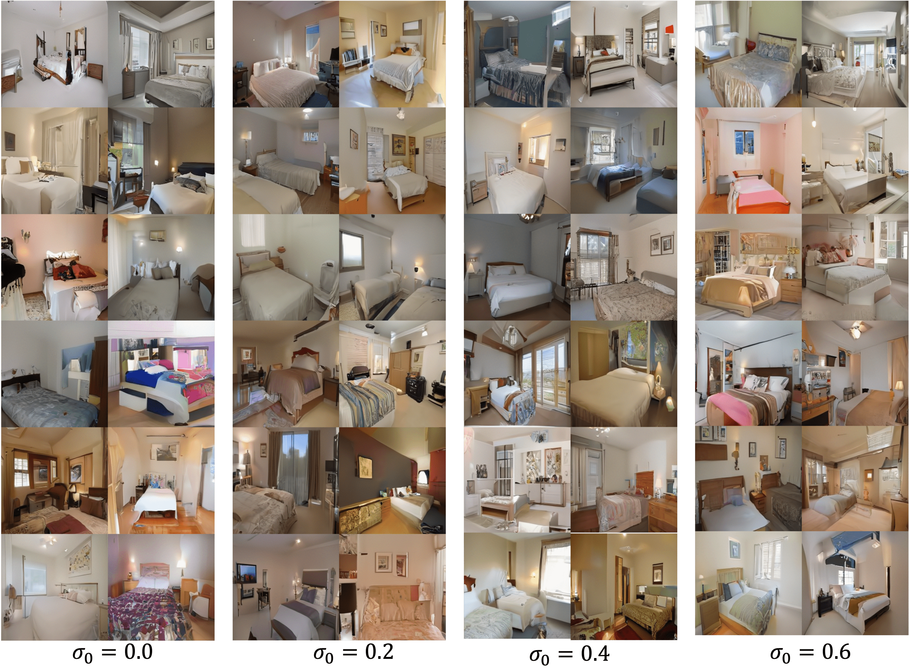
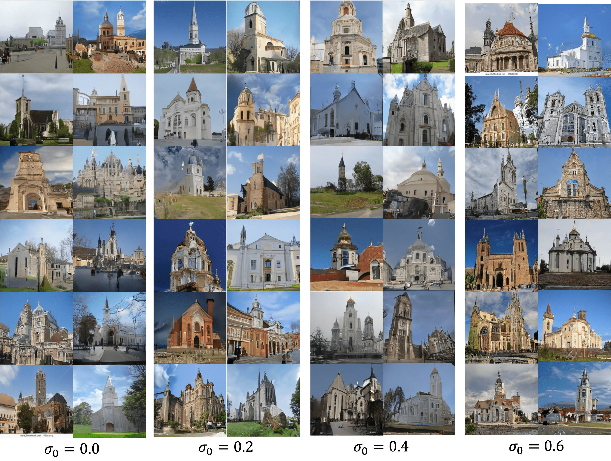
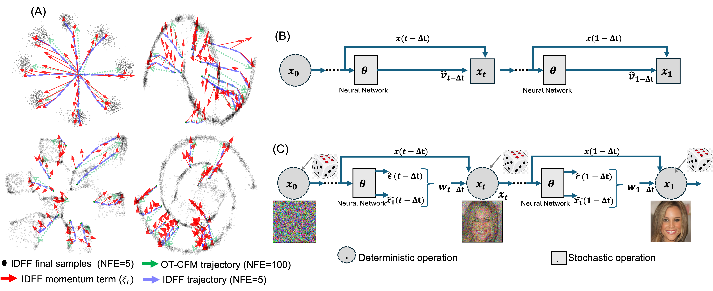

# Implicit Dynamical Flow Fusion (IDFF) for Generative Modeling

<p align="center">
<em> Only 1 GPU is required. </em>
</p>

**IDFF** is a novel generative modeling framework that simultaneously learns an implicit flow and a scoring model.  
These components operate jointly during sampling, enabling fast, accurate generation across both images and time-series data.

Thanks to its momentum-driven structure, **IDFF reduces the number of function evaluations (NFE) by more than 10×** compared to traditional conditional flow matching (CFM) models.

<p align="center">

</p>

<p align="center">
<em>Image generation using IDFF (NFE=10) across multiple datasets: CIFAR-10, CelebA-64, ImageNet-64, LSUN-Bedroom, LSUN-Church, CelebA-HQ.</em>
</p>

---

## ✨ Image Generation Samples

### CelebA-HQ 256×256 ( NFE = 10)

<p align="center">

</p>

---

### LSUN-Bedroom ( NFE = 10)

<p align="center">

</p>

---

### LSUN-Church (\ NFE = 10)

<p align="center">

</p>

---

## 🔍 Trajectory Visualization

<p align="center">

</p>

<p align="center">
<em>
Comparison between IDFF and OT-CFM trajectory sampling.  
IDFF takes larger, more informed steps toward the target distribution using a learned momentum term, 
while OT-CFM takes smaller, more direct steps but with higher NFE requirements.
</em>
</p>

---

## 📥 Usage

To run image generation examples with IDFF, use the script:

```
python simple_gen_test.py 
```

You must either download the pretrained weights or train models from scratch.  
Place pretrained weights in the corresponding `results/IDFF-2.0-0.2/` directory for each dataset.

---

## 🧪 FID Evaluation

To compute the FID score using 50K samples:

1. Generate IDFF samples:
   ```
   python gen_cifar10.py 
   ```

2. Generate original samples for CIFAR-10:
   ```
   python gen_true_cifar10.py 
   ```

3. Compute FID using [pytorch_fid](https://github.com/mseitzer/pytorch-fid):
   ```
   python -m pytorch_fid /path_to_original_samples /path_to_generated_samples
   ```

---

## 📚 Dataset Preparation

For CelebA-HQ 256 and LSUN datasets, follow [NVAE's data setup instructions](https://github.com/NVlabs/NVAE#set-up-file-paths-and-data).  
Datasets for other experiments are provided [here](#) (link placeholder).

---

## 📝 Citation

If you use this repository for your work, please cite the corresponding paper:

```bibtex
```

---
