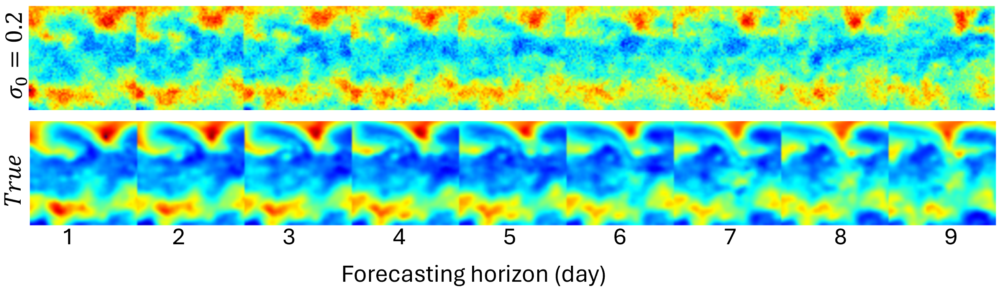
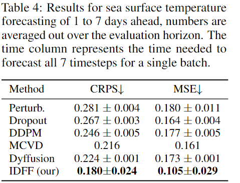
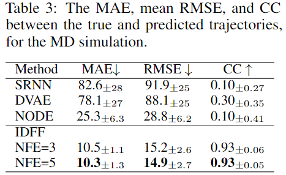

# Implicit Dynamical Flow Fusion (IDFF) for Generative Modeling

<p align="center">
<em> Only 1 gpu is required. </em>
</p>
A simple toy example [Notebook](2D-toys/2D-toy-examples.pyynb)

IDFF simultaneously learns an implicit flow and a scoring model
that come together during the sampling process. This structure allows
**IDFF to reduce the number of function evaluations (NFE) by more than 10 times** 
compared to traditional CFMs, enabling rapid sampling and efficient handling
of image and time-series data generation tasks.
See bellow for an illustration:


<p align="center">

</p>

<p align="center">
<em> The final samples are generated with NFE=10</em>
</p>


For more information, please see our paper,
[Implicit Dynamical Flow Fusion (IDFF) for Generative Modeling]().

## Usage

To utilize IDFF for image generation examples, execute the following command for each dataset (inside each directory):
```
python simple_gen_test.py 
```
To run the code, you must either download the pretrained model from the link below or train it from scratch.

Each pretrained model should be placed in the ```results/IDFF-2.0-0.2``` directory associated with each example.
## Pretrained Image Generation Models
<table>
  <tr>
    <th>Exp</th>
    <th>Args</th>
    <th>FID</th>
    <th>NFE</th>
    <th>Checkpoints</th>
    <th>Samples</th>
  </tr>

  <tr>
    <td> CIFAR-10 </td>
    <td><a href="cifar10/simple_gen_test.py"> cifar10/simple_gen_test.py</a></td>
    <td>5.87</td>
    <td>10</td>
    <td><a href="https://drive.google.com/file/d/1973PZkSWH_7iVWBQ6xmQAPcdQGmnSgwu/view?usp=sharing">IDFF_cifar10_weights_step_final.pt</a></td>
    <td><a href="assets/cifar10_samples.png">cifar10_samples</a></td>
  </tr>

  <tr>
    <td> CelebA-64 </td>
    <td><a href="celebA/simple_gen_test.py"> celebA/simple_gen_test.py</a></td>
    <td>11.83</td>
    <td>10</td>
    <td><a href="https://drive.google.com/file/d/1tC9cDLb11fTCou_iLt39KvIsBc1ZGAI4/view?usp=drive_link">IDFF_celeba_weights_step_final.pt</a></td>
    <td><a href="assets/celeba_samples.png">celeba_64_samples</a></td>
  </tr>

  <tr>
    <td> CelebA-256 </td>
    <td><a href="celebA_HQ/simple_gen_test.py"> celebA_HQ/simple_gen_test.py</a></td>
    <td>---</td>
    <td>10</td>
    <td><a href="">IDFF_celeba_256_weights_step_final.pt</a></td>
    <td><a href="assets/celeb_HQ_samples.png">celeba_256_samples</a></td>
  </tr>
    
  <tr>
    <td> LSUN-Bed </td>
    <td><a href="lsun_bed/simple_gen_test.py"> lsun_bed/simple_gen_test.py</a></td>
    <td>---</td>
    <td>10</td>
    <td><a href="">IDFF_lsun_bed_weights_step_final.pt</a></td>
    <td><a href="assets/lsun_bed_samples.png">lsun_bed_samples</a></td>
  </tr>

  <tr>
    <td> LSUN-Church </td>
    <td><a href="lsun_church/simple_gen_test.py"> lsun_church/simple_gen_test.py</a></td>
    <td>12.86</td>
    <td>10</td>
    <td><a href="">IDFF_lsun_church_weights_step_final.pt</a></td>
    <td><a href="assets/lsun_church_samples.png">lsun_church_samples</a></td>
  </tr>
</table>


## Pretrained Time-series Generation Models

### Sea Surface Temperature (SST) Forecasting
<table>
  <tr>
    <th>Exp</th>
    <th>Args</th>
    <th>Checkpoints</th>
 
  </tr>

  <tr>
    <td> SST </td>
    <td><a href="sst/sst_forecaster.py"> sst/sst_forecaster.py</a></td>
    <td><a href="https://drive.google.com/file/d/1z0Z6tXbwZzrUvQrBFqiyjmc99JuhOj-s/view?usp=sharing">IDFF_sst_weights_step_final.pt</a></td>
    
  </tr>
</table>
<p align="center">

</p>
<p align="center">

</p>

### Molecular Dynamic
<table>
  <tr>
    <th>Exp</th>
    <th>Args</th>
    <th>Checkpoints</th>
 
  </tr>

  <tr>
    <td> MD </td>
    <td><a href="timeseries_examples/MD_simulation.py"> timeseries_examples/MD_simulation.py</a></td>
    <td><a href="https://drive.google.com/file/d/1Pcq8BFkk4y1YirBdxK1ADM6hPMAbFC-P/view?usp=sharing">IDFF_MD_v1.pt</a></td>
    
  </tr>
</table>
<p align="center">

</p>
<p align="center">

</p>

## Dataset preparation 

For CelebA HQ 256 and LSUN datasets, we used instruction provided here [NVAE's instructions](https://github.com/NVlabs/NVAE#set-up-file-paths-and-data) out.

The datasets for SST and MD experiments are provided [Here]().
## FID
To calculate the FID score using 50K samples, you need to generate 50K samples. For instance, you can use the following commands:


```
python gen_cifar10.py 
```
To generate original samples for CIFAR-10:  
```
python gen_true_cifar10.py 
```
Finally, you can use [pytorch_fid](https://github.com/mseitzer/pytorch-fid) to compute the FID between the two sets of samples with the following code:
```
python -m pytorch_fid  /path_to_original_samples  /path_to_generated_samples
```
## Citation
When utilizing this repository to aid in generating published results or integrating it into other software, kindly acknowledge our paper by citing it.
```bibtex
@article{xx,
  title={xx},
  author={xx},
  journal={xx},
  year={xx}
}
```

## Contacts
