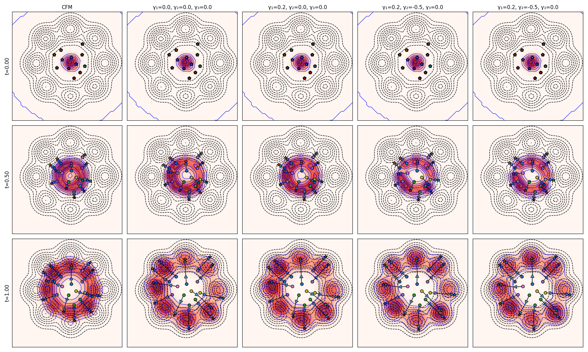
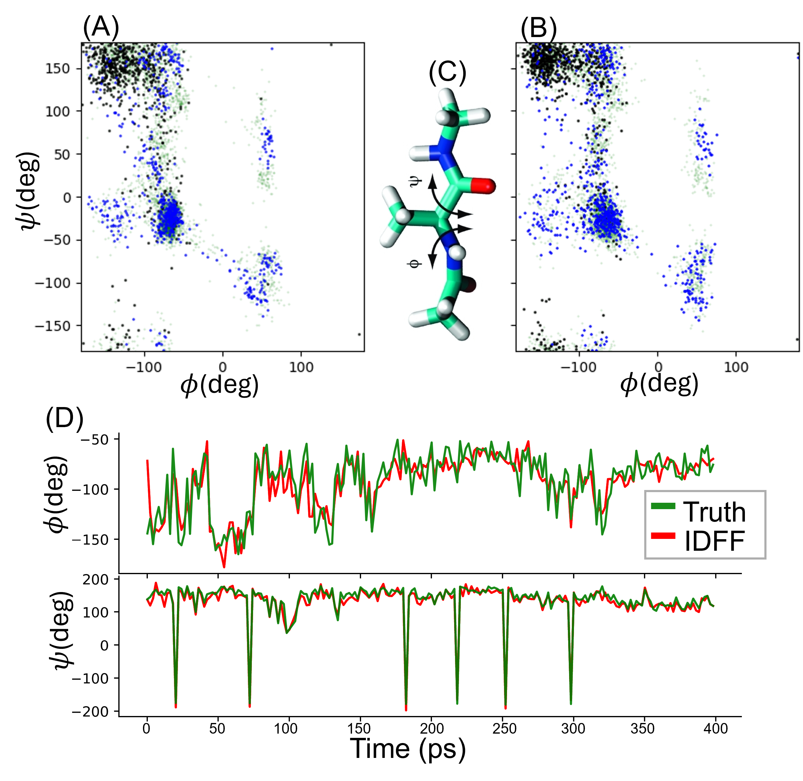

# Implicit Dynamical Flow Fusion (IDFF) for Generative Modeling

<p align="center">
<em>Only 1 GPU is required.</em>
</p>


**IDFF** is a novel generative modeling framework that simultaneously learns an implicit flow and a scoring model.  
These components operate jointly during sampling, enabling fast, accurate generation across both images and time-series data.

Thanks to its momentum-driven structure, **IDFF reduces the number of function evaluations (NFE) by more than 10×** compared to traditional conditional flow matching (CFM) models.

<p align="center">

</p>

## 🔬 Key Features

- Combines score-based and flow-based generative models in a unified second-order SDE framework.
- Dynamically modulates sample generation with first- and second-order gradients, controlled by `γ₁`, `γ₂`, ...
-  Supports both 2D synthetic distributions (e.g., checkerboard, spirals) and high-dimensional molecular dynamics (MD) data.
- **Fast Inference**: High-quality samples with as few as 2–3 function evaluations.
- **Easy Integration**: Compatible with `torchdiffeq` and `torchsde` solvers; plug in your own models.

## 🧪 2D Toy Example:

We demonstrate the effect of IDFF on a synthetic 2D distribution using KDE overlays and trajectory visualization.

- Models tested:  
  - Standard CFM  
  - IDFF with various $(\gamma_1, \gamma_2)$ configurations

- Metric: **Maximum Mean Discrepancy (MMD)**  
  - IDFF achieves lower MMD than CFM even with fewer NFEs

**Run:**
```bash
python 2D_examples/Autograd_example_order2.py
````

<p align="center">

</p>


## 🧬 Molecular Dynamics: PolyALA

We apply IDFF to molecular dynamics simulations, specifically backbone dihedral trajectories from PolyALA molecular chains.

* Objective: Learn to generate dynamics of PolyALA molecular chain.
* Architecture: MLP-based embedding model trained with IDFF.
* Output: Generated trajectories, phase space plots, and metrics like RMSE, MAE, CC.

**Train & Evaluate:**

```bash
python timeseris_example/MD_simulation.py
```

-Example Phase Space Plot:

<p align="center">

</p>

You can customize the following parameters:
* `gamma1`, `gamma2`: momentum modulation
* `nfe`: number of function evaluations


## 📦 Dependencies

* `torch`, `torchsde`, `torchdiffeq`
* `matplotlib`, `seaborn`, `scikit-learn`
* `scipy`, `pandas`, `numpy`

Install dependencies:

```bash
pip install -r requirements.txt
```

## 🧠 Citation

If you find this work useful, please cite:

```
@misc{rezaei2025implicitdynamicalflowfusion,
      title={Implicit Dynamical Flow Fusion (IDFF) for Generative Modeling}, 
      author={Mohammad R. Rezaei and Milos R. Popovic and Milad Lankarany and Rahul G. Krishnan},
      year={2025},
      eprint={2409.14599},
      archivePrefix={arXiv},
      primaryClass={cs.LG},
      url={https://arxiv.org/abs/2409.14599}, 
}
```

## 📬 Contact

For questions, feel free to raise an issue.

